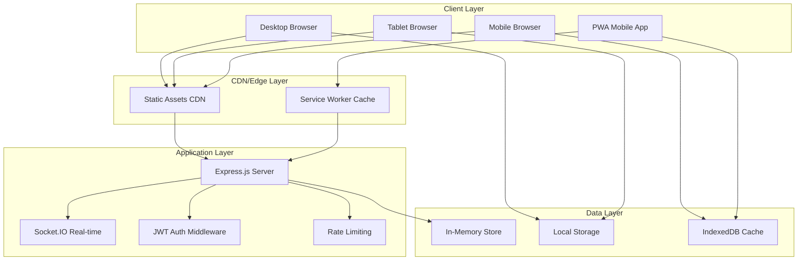

# Design Document

## Overview

This design extends the existing SCOSY (Student Complaint System) to provide comprehensive multi-device functionality with responsive design, cross-device synchronization, and optimized user experiences. The system will maintain the current Node.js/Express backend architecture while enhancing the frontend with progressive web app capabilities and real-time synchronization.

## Architecture

### High-Level Architecture



### Responsive Design Strategy

The application will use a mobile-first approach with three main breakpoints:
- **Mobile**: 320px - 768px (touch-optimized)
- **Tablet**: 768px - 1024px (hybrid touch/mouse)
- **Desktop**: 1024px+ (mouse/keyboard optimized)

## Components and Interfaces

### 1. Responsive Layout System

**Component**: `ResponsiveLayoutManager`
- **Purpose**: Manages layout transitions and component visibility across devices
- **Key Methods**:
  - `detectDevice()`: Identifies device type and capabilities
  - `adaptLayout(breakpoint)`: Adjusts UI components for screen size
  - `optimizeTouch()`: Enhances touch interactions on mobile devices

**Interface**:
```javascript
interface ResponsiveLayoutManager {
  currentBreakpoint: string;
  deviceCapabilities: DeviceCapabilities;
  adaptLayout(breakpoint: string): void;
  registerBreakpointListener(callback: Function): void;
  optimizeForTouch(enabled: boolean): void;
}
```

### 2. Cross-Device Synchronization

**Component**: `SyncManager`
- **Purpose**: Handles real-time data synchronization across user devices
- **Key Methods**:
  - `syncUserData()`: Synchronizes user preferences and data
  - `handleConflictResolution()`: Resolves data conflicts using last-write-wins
  - `queueOfflineChanges()`: Stores changes when offline

**Interface**:
```javascript
interface SyncManager {
  deviceId: string;
  syncState: SyncState;
  syncUserData(data: UserData): Promise<void>;
  handleOfflineQueue(): Promise<void>;
  resolveConflicts(conflicts: DataConflict[]): void;
}
```

### 3. Progressive Web App (PWA) Manager

**Component**: `PWAManager`
- **Purpose**: Manages service worker, caching, and offline functionality
- **Key Methods**:
  - `registerServiceWorker()`: Sets up caching and offline support
  - `handleOfflineMode()`: Manages offline functionality
  - `syncWhenOnline()`: Syncs queued data when connectivity returns

### 4. Touch Interaction Controller

**Component**: `TouchController`
- **Purpose**: Optimizes touch interactions for mobile and tablet devices
- **Key Methods**:
  - `enableTouchGestures()`: Adds swipe, pinch, and tap gestures
  - `optimizeTouchTargets()`: Ensures 44px minimum touch targets
  - `handleTouchFeedback()`: Provides visual feedback for touch interactions

## Data Models

### Enhanced User Model
```javascript
interface User {
  // Existing fields
  name: string;
  matric: string;
  email: string;
  level: string;
  userType: 'student' | 'admin';
  
  // New multi-device fields
  devices: Device[];
  preferences: UserPreferences;
  lastSyncTime: string;
  offlineData?: OfflineData;
}
```

### Device Model
```javascript
interface Device {
  deviceId: string;
  deviceType: 'mobile' | 'tablet' | 'desktop';
  userAgent: string;
  lastActive: string;
  syncEnabled: boolean;
  pushToken?: string;
}
```

### User Preferences Model
```javascript
interface UserPreferences {
  theme: 'light' | 'dark' | 'auto';
  notifications: NotificationSettings;
  layout: LayoutPreferences;
  accessibility: AccessibilitySettings;
}
```

### Offline Data Model
```javascript
interface OfflineData {
  queuedComplaints: Complaint[];
  queuedResponses: Response[];
  cachedData: CachedData;
  lastOfflineSync: string;
}
```

## Error Handling

### Network Error Handling
- **Connection Loss**: Automatically queue user actions for later sync
- **Sync Conflicts**: Use last-write-wins with user notification
- **Authentication Errors**: Graceful re-authentication flow
- **Rate Limiting**: Progressive backoff with user feedback

### Device-Specific Error Handling
- **Touch Errors**: Fallback to standard click events
- **Orientation Changes**: Smooth layout transitions
- **Memory Constraints**: Intelligent cache management
- **Battery Optimization**: Reduce background sync frequency

## Testing Strategy

### 1. Responsive Design Testing
- **Cross-Browser Testing**: Chrome, Firefox, Safari, Edge on all device types
- **Device Testing**: Physical testing on iOS/Android devices and tablets
- **Viewport Testing**: Automated testing across breakpoint ranges
- **Touch Testing**: Gesture recognition and touch target validation

### 2. Synchronization Testing
- **Multi-Device Scenarios**: Simultaneous actions across devices
- **Offline/Online Transitions**: Data integrity during connectivity changes
- **Conflict Resolution**: Concurrent edits and resolution accuracy
- **Performance Testing**: Sync speed and resource usage

### 3. PWA Testing
- **Installation Testing**: Add to home screen functionality
- **Offline Testing**: Core functionality without internet
- **Cache Testing**: Asset caching and update mechanisms
- **Push Notifications**: Cross-platform notification delivery

### 4. Performance Testing
- **Load Time Testing**: 3G network simulation for mobile
- **Memory Usage**: Testing on low-end devices
- **Battery Impact**: Background sync and processing efficiency
- **Accessibility Testing**: Screen reader and keyboard navigation

## Implementation Phases

### Phase 1: Responsive Foundation
- Implement CSS Grid/Flexbox responsive layouts
- Add touch-optimized components
- Create breakpoint management system
- Enhance existing forms for mobile input

### Phase 2: PWA Implementation  
- Add service worker for caching and offline support
- Implement app manifest for installation
- Create offline queue management
- Add push notification infrastructure

### Phase 3: Cross-Device Sync
- Extend Socket.IO for device-specific channels
- Implement conflict resolution algorithms
- Add device management interface
- Create sync status indicators

### Phase 4: Performance Optimization
- Implement lazy loading for components
- Add image optimization and responsive images
- Optimize JavaScript bundles for mobile
- Add performance monitoring and analytics

## Security Considerations

### Multi-Device Security
- **Device Registration**: Secure device identification and registration
- **Session Management**: Per-device session tracking and invalidation
- **Data Encryption**: End-to-end encryption for synced data
- **Access Control**: Device-based access permissions

### PWA Security
- **Service Worker Security**: Secure caching and update mechanisms
- **Offline Data Protection**: Encrypted local storage
- **Push Notification Security**: Secure token management
- **Content Security Policy**: Enhanced CSP for PWA features

## Performance Targets

### Loading Performance
- **First Contentful Paint**: < 1.5s on 3G networks
- **Time to Interactive**: < 3s on mobile devices
- **Largest Contentful Paint**: < 2.5s across all devices

### Runtime Performance
- **Touch Response**: < 100ms touch feedback
- **Sync Latency**: < 5s for cross-device updates
- **Offline Queue**: Support for 100+ queued actions
- **Memory Usage**: < 50MB on mobile devices

## Accessibility Compliance

### WCAG 2.1 AA Compliance
- **Keyboard Navigation**: Full functionality without mouse
- **Screen Reader Support**: Proper ARIA labels and roles
- **Color Contrast**: 4.5:1 ratio for normal text
- **Touch Targets**: Minimum 44px for all interactive elements
- **Focus Management**: Clear focus indicators and logical tab order